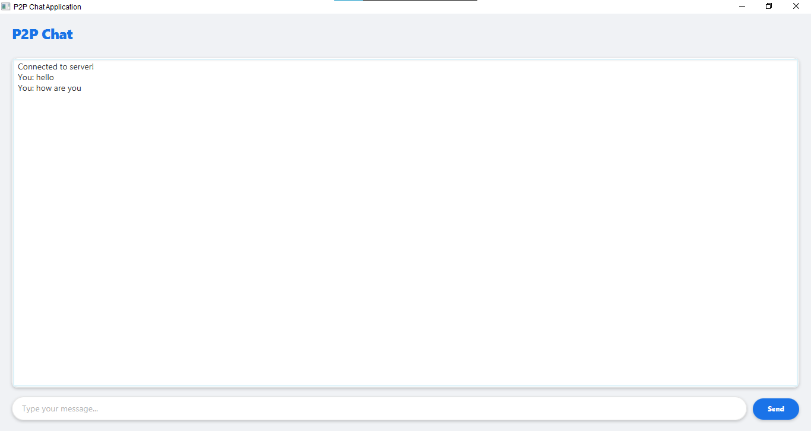

# P2P Chat Application

A basic peer-to-peer chat application built with Java and JavaFX. This is a **demonstration project** and is not suitable for production use.

## 📸 Screenshots

*Main chat interface with basic design*

## ⚠️ Important Notice

This application is for educational purposes only and should not be used in production environments due to:
- Basic encryption implementation
- Limited security features
- No user authentication
- No message persistence
- Basic error handling
- No production-grade testing

## Features

- Real-time messaging
- Modern GUI with JavaFX
- Basic end-to-end encryption
- Multiple client support
- Cross-platform compatibility

## Prerequisites

- Java JDK 17 or higher
- Maven 3.6 or higher
- JavaFX SDK
